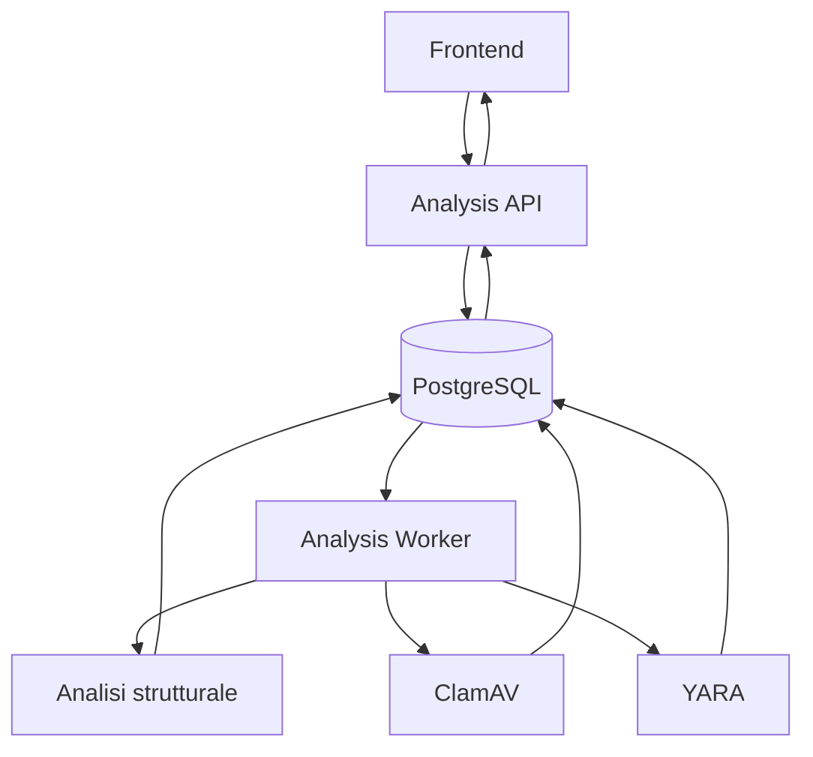

# SecureScan Analysis Worker

L'Analysis Worker è il componente asincrono responsabile dell'elaborazione delle analisi create dall'Analysis API.

La sua responsabilità è completare la pipeline di scansione senza bloccare il flusso HTTP principale: l'Analysis API riceve il file, crea un job persistito in PostgreSQL e restituisce rapidamente la risposta al frontend. Successivamente il worker recupera il job, esegue la pipeline di analisi e aggiorna il risultato finale mostrato nelle pagine Cronologia e Dettaglio analisi.

Il componente rappresenta il livello di elaborazione malware della piattaforma SecureScan Cloud e permette di separare le operazioni intensive dal livello API.

## Ruolo nell'architettura SecureScan Cloud

Il worker completa il flusso asincrono introdotto dall'Analysis API.



Il worker non comunica direttamente con il browser. Tutti i risultati vengono persistiti nel database e successivamente esposti dalle API al frontend.

## Separazione tra API e Worker

La scansione malware può richiedere tempi superiori rispetto alla durata ideale di una richiesta HTTP.

Separare il worker dall'Analysis API permette di:

- mantenere il livello API veloce e responsivo;
- evitare timeout durante elaborazioni lunghe;
- scalare indipendentemente il numero di processi di analisi;
- isolare eventuali errori della pipeline malware;
- implementare meccanismi di recovery.

L'Analysis API gestisce la creazione e persistenza iniziale del job, mentre il worker esegue la fase di elaborazione.

## Lifecycle di un'analisi

Ogni analisi attraversa diversi stati persistiti nella tabella `analyses`.

```
queued
   |
   v
processing
   |
   +--> completed
   |
   +--> failed
```

Lo stato `queued` identifica un job creato dall'API ma non ancora elaborato.

Lo stato `processing` indica che un worker ha acquisito il job e sta eseguendo la pipeline.

Lo stato `completed` rappresenta una scansione completata correttamente, mentre `failed` viene utilizzato quando l'elaborazione non può terminare correttamente.

## Coda applicativa basata su PostgreSQL

SecureScan Cloud utilizza PostgreSQL come coda applicativa senza introdurre un broker esterno come RabbitMQ o Kafka.

La gestione dei job avviene tramite:

- stato dell'analisi;
- timestamp di elaborazione;
- identificativo del worker;
- numero di tentativi effettuati.

Il worker esegue polling periodico sul database per individuare nuovi job disponibili.

Questa scelta mantiene l'architettura più semplice, sfruttando comunque le funzionalità transazionali offerte da PostgreSQL.

## Concorrenza e alta disponibilità

Il sistema supporta più repliche worker contemporaneamente.

L'acquisizione dei job utilizza:

```sql
FOR UPDATE SKIP LOCKED
```

Questo meccanismo permette di bloccare il record acquisito da un worker evitando che altre repliche prendano contemporaneamente lo stesso job.

Quando un worker acquisisce un'analisi:

- il record viene temporaneamente bloccato;
- gli altri worker ignorano quel record;
- una replica disponibile può elaborare un altro job in coda.

Questa strategia permette una gestione concorrente sicura anche con più istanze attive.

## Recovery dei job

Il worker implementa meccanismi di recupero automatico per gestire eventuali interruzioni durante l'elaborazione.

Sono gestiti:

- job rimasti nello stato `processing`;
- timeout configurabili;
- ripristino automatico nello stato `queued`;
- limite massimo di tentativi;
- fallimento definitivo dopo il superamento dei retry consentiti.

Se una replica worker termina durante una scansione, un'altra replica può recuperare il job senza intervento manuale.

## Pipeline di analisi malware

La pipeline combina diversi livelli di analisi statica.

Il file viene analizzato senza essere mai eseguito.

### Analisi strutturale

La prima fase raccoglie indicatori tecnici preliminari.

Vengono calcolati:

- hash SHA-256;
- tipo MIME tramite contenuto e signature binarie;
- entropia di Shannon;
- coerenza tra estensione e tipo MIME;
- indicatori tecnici.

Questi dati forniscono segnali utili per la valutazione del rischio, ma non determinano autonomamente la presenza di malware.

### ClamAV

ClamAV rappresenta il motore antivirus principale della pipeline.

Il worker comunica con `clamd` tramite protocollo TCP utilizzando la modalità `INSTREAM`.

```text
INSTREAM
```

Il contenuto del file viene inviato direttamente come sequenza di byte senza eseguire il file.

Sono gestiti:

- file puliti;
- firme malware rilevate;
- timeout;
- errori di comunicazione;
- indisponibilità del servizio.

### YARA

YARA aggiunge un livello di analisi basato su regole personalizzate.

Il worker:

- carica le regole configurate;
- le compila una sola volta;
- applica il matching sui byte del file;
- conserva metadata e severità dei risultati.

I match possono essere classificati come:

- `test`;
- `suspicious`;
- `malicious`.

## Aggregazione del risultato finale

I risultati prodotti dai diversi controlli vengono aggregati per generare:

- verdict finale;
- livello di rischio;
- indicatori tecnici.

I verdict supportati sono:

| Verdict | Significato |
|---|---|
| `clean` | Nessun indicatore rilevante rilevato |
| `suspicious` | Presenza di segnali anomali |
| `malicious` | Rilevamento di una minaccia |
| `scan_error` | Impossibilità di completare correttamente la scansione |

La logica è volutamente conservativa: se un motore obbligatorio non completa correttamente la scansione, il file non viene considerato automaticamente sicuro.

## Sicurezza della pipeline

Il worker esegue esclusivamente analisi statiche.

Durante il processo:

- il file non viene eseguito;
- il contenuto viene analizzato solamente come dato binario;
- ClamAV e YARA rimangono servizi interni;
- il browser non comunica direttamente con il sistema di scansione.

Questo riduce la superficie di attacco e mantiene separato il livello di analisi dal livello applicativo.

## Heartbeat e monitoraggio

Ogni replica worker registra il proprio stato operativo nel database.

Sono mantenuti:

- identificativo del worker;
- hostname;
- stato operativo;
- timestamp dell'ultimo heartbeat.

Queste informazioni vengono utilizzate per monitorare la disponibilità della pipeline nella sezione Stato del sistema.

## Health Check

Il worker espone un endpoint dedicato:

```http
GET /health
```

L'endpoint verifica:

- stato del processo worker;
- raggiungibilità del database;
- corretto funzionamento del polling;
- presenza di errori persistenti.

La risposta rappresenta quindi lo stato reale del servizio e non solamente la disponibilità del processo HTTP.

## Metriche Prometheus

Il worker espone metriche compatibili con Prometheus tramite:

```http
GET /metrics
```

Le metriche raccolte includono:

- job acquisiti;
- job completati;
- job falliti;
- job recuperati;
- durata delle elaborazioni;
- scansioni ClamAV;
- scansioni YARA;
- errori di polling;
- stato del loop worker.

Questi dati possono essere raccolti da Prometheus e visualizzati tramite Grafana.

## Configurazione runtime

Il comportamento del worker viene controllato tramite variabili ambiente.

Le principali configurazioni sono:

| Variabile | Descrizione |
|---|---|
| `DATABASE_URL` | Connessione PostgreSQL |
| `CLAMD_HOST` | Host del servizio ClamAV |
| `CLAMD_PORT` | Porta del servizio ClamAV |
| `YARA_RULES_DIR` | Directory contenente le regole YARA |
| `WORKER_POLL_INTERVAL_SECONDS` | Frequenza del polling |
| `WORKER_PROCESSING_TIMEOUT_SECONDS` | Timeout dei job in elaborazione |
| `WORKER_MAX_ATTEMPTS` | Numero massimo di tentativi |
| `WORKER_HEALTH_PORT` | Porta degli endpoint di monitoraggio |

## Test automatici

Il componente include test dedicati per verificare:

- ciclo principale del worker;
- acquisizione e aggiornamento dei job;
- recovery delle elaborazioni bloccate;
- analisi strutturale;
- integrazione ClamAV;
- scansione YARA;
- configurazione runtime.

## Esecuzione locale

Nel deployment Docker Compose il worker viene eseguito come servizio indipendente:

```text
analysis-worker
```

Endpoint interni:

```text
Health:
http://analysis-worker:8081/health

Metriche:
http://analysis-worker:8081/metrics
```

## Collegamenti documentazione

- [README principale](../../README.md)
- [Analysis API](../analysis-api/README.md)
- [Malware scanning](../../docs/malware-scanning.md)
- [Request flow](../../docs/request-flow.md)
- [Esperimenti HA](../../docs/experiments.md)